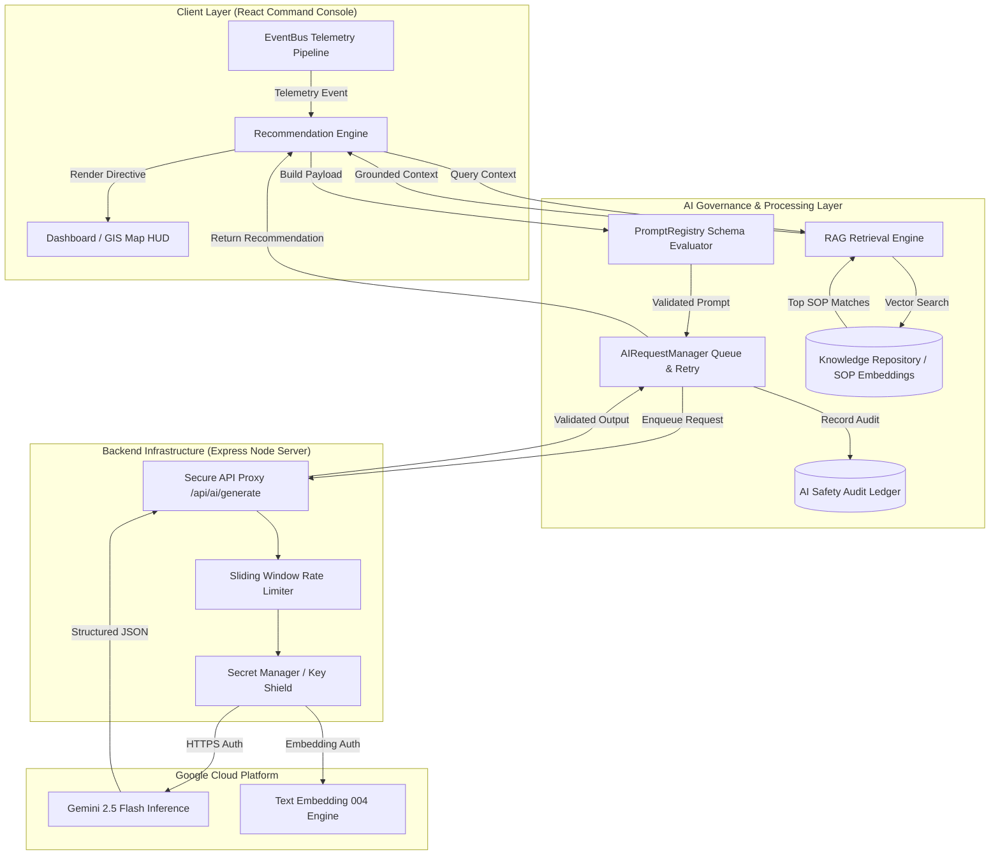

# Stadium Nexus — FIFA World Cup 2026™ Tournament Operations Center

[]()
[]()
[]()
[]()
[]()
[](LICENSE)

Stadium Nexus is an enterprise-grade cognitive operations console designed for venue management and multi-agency response during the **FIFA World Cup 2026™**. It unifies real-time stadium telemetry—turnstile throughput, sector crowd densities, public transit arrival rates, weather alerts, and emergency dispatch events—into an interactive operational command center. Powered by the **Google GenAI SDK**, Stadium Nexus features a server-side AI runtime with Retrieval-Augmented Generation (RAG), strict schema enforcement, reflection tracing, and human-in-the-loop governance.

---

## Project Overview

### What Stadium Nexus Is
Stadium Nexus is a real-time command-and-control platform that aggregates IoT telemetry, security alerts, and venue operations into a single operational interface. It translates raw operational signals into actionable mitigation directives for tournament operators, safety officers, and field personnel.

### The FIFA World Cup 2026 Operational Problem
The 2026 FIFA World Cup spans 16 host stadiums across North America, handling over 80,000 spectators per venue. Operational teams face complex, concurrent challenges:
- Bottlenecks at turnstiles causing severe gate queues prior to kickoff.
- Rapid weather changes impacting spectator ingress/egress.
- Transport disruptions requiring dynamic shuttle and transit re-routing.
- Emergency dispatch coordinate delays in high-density sectors.

Traditional command center software relies on manual monitoring and static playbooks. Human operators must parse dozens of disparate dashboards, delaying response times during critical incidents.

### Why Generative AI Is Necessary
Generative AI provides rapid situational synthesis across high-cardinality telemetry streams. By combining **Gemini 2.5 Flash** with localized Standard Operating Procedures (SOPs), Stadium Nexus:
1. Synthesizes complex multi-variable incidents (e.g., turnstile failure + heavy rainfall + gate congestion) within milliseconds.
2. Drafts structured, policy-compliant resolution directives grounded in official FIFA operational playbooks.
3. Ranks proposed actions by impact and urgency while enforcing mandatory human-in-the-loop review.

---

## Problem Statement Alignment

Stadium Nexus addresses operational requirements across all tournament stakeholders:

| Stakeholder | Pain Point | Stadium Nexus Solution |
| :--- | :--- | :--- |
| **Fans** | Excessive gate wait times, sector overcrowding, directional confusion. | Real-time crowd redistribution recommendations, gate pacing, dynamic signage updates. |
| **Organizers** | Fragmented oversight across venue sub-systems. | Unified operational dashboard integrating turnstiles, weather, transit, and medical feeds. |
| **Venue Staff** | Delayed notification of localized equipment or infrastructure faults. | Automated anomaly detection triggering instant staff re-allocation recommendations. |
| **Volunteers** | Lack of real-time situational guidance during stadium events. | Structured, role-based action directives dispatched via the collaboration service. |
| **Security Teams** | Uncoordinated crowd pressure management at entry gates. | AI-driven perimeter load balancing and automated conflict detection between directives. |
| **Emergency Responders** | Obstructed transit corridors and delayed incident location mapping. | Emergency dispatch routing with real-time sector density mapping and obstruction alerts. |
| **Accessibility Users** | Elevators or accessible pathways obstructed by sudden queue bottlenecks. | Dedicated SOP vector retrieval prioritizing barrier-free rerouting during congestion. |
| **Transportation Ops** | Sudden exit rushes overwhelming metro and bus feeder stations. | Predictive transit line pacing synchronized with match stage milestones (e.g., 85th minute egress). |

---

## Key Features

### AI Decision Support
- **Automated Incident Evaluation**: Continuously assesses incoming operational events and generates structured recommendations.
- **Priority Scoring Engine**: Ranks recommendations using a weighted multi-factor scoring model based on urgency, confidence, and resource impact.
- **Conflict & Resource Guardrails**: Detects double-allocation of staff/equipment and flags contradictory operational directives before approval.

### RAG & Knowledge Intelligence
- **Hybrid Vector Search**: Combines cosine vector similarity (`text-embedding-004`) with keyword filtering over official FIFA stadium SOPs.
- **Dynamic Context Injection**: Grounds AI prompts with validated SOP guidelines to eliminate hallucinations.
- **SOP Metadata Validation**: Validates SOP versioning and applicability tags prior to model context assembly.

### Crowd Management & Simulation
- **Live Density Heatmaps**: Renders sector-by-sector crowd distribution and turnstile throughput rates.
- **Virtual Simulation Engine**: Simulates match stages (`Pregame`, `Ingress`, `Kickoff`, `Halftime`, `Egress`) and environmental scenarios (`SC-RAIN`, `SC-STRIKE`) to test operational resilience.

### Emergency Response & Workflow
- **Multi-Agency Dispatch**: Directs medical, security, and technical teams with estimated arrival times and task checklists.
- **Stateful Workflow Queue**: Tracks recommendation lifecycles (`PENDING_REVIEW` → `APPROVED` → `EXECUTED` → `FEEDBACK_RECORDED`).

### Collaboration & Communication
- **Multi-Operator Sync**: Real-time record locking and presence tracking across command center consoles.
- **Offline Resilient Buffer**: Enqueues operator messages and actions during network disruptions and auto-flushes upon reconnection.

### AI Governance & Observability
- **Immutable Audit Ledger**: Records all prompt IDs, model metadata, latency, and human decision overrides.
- **Reflection Tracing**: Captures rationale and supporting evidence for every generated directive.
- **Platform Telemetry Manager**: Monitors FPS, memory utilization, component health, and API latency metrics.

---

## AI Architecture

The AI subsystem isolates client interfaces from backend inference using a secure Express API proxy, an asynchronous request manager, and a RAG pipeline.



### Subsystem Responsibilities
- **`AIRequestManager`**: Manages FIFO/Priority queues, limits concurrency, handles exponential backoff retries, and executes fallback routines.
- **`PromptRegistry`**: Maintains versioned prompt templates (`v1.0`, `v2.5`) with variable injection and strict parameter validation.
- **`Secure AI Proxy`**: Express proxy server insulating `GEMINI_API_KEY` from browser client bundles while enforcing model whitelisting and request limits.
- **`RAG Pipeline`**: Fetches relevant SOP context via hybrid semantic and keyword search.
- **`Safety Ledger`**: Provides immutable audit tracking for compliance, security inspection, and post-event analysis.

---

## Technology Stack

| Domain | Technology / Framework | Purpose |
| :--- | :--- | :--- |
| **Frontend** | React 18, TypeScript 5.8, TailwindCSS, Lucide Icons | Responsive command console UI with sub-16ms render performance. |
| **Build System** | Vite 6.4, ESBuild | Fast dev server, HMR, and optimized production chunk splitting. |
| **Backend / Proxy** | Node.js, Express.js | Secure server-side proxy gateway, rate limiting, and security headers. |
| **AI Core** | `@google/genai` SDK, Gemini 2.5 Flash, Text Embedding 004 | High-throughput structured JSON generation and vector embeddings. |
| **Testing** | Vitest 4.1, React Testing Library | Unit, component, and end-to-end integration test execution. |
| **Security** | Express Rate Limiters, Input Sanitizers, CSP Headers | Server-side protection against XSS, SSRF, DoS, and prompt injection. |

---

## Security Implementation

Stadium Nexus incorporates production-grade security standards designed for enterprise audit compliance:

1. **Zero-Client Key Exposure**: `GEMINI_API_KEY` resides strictly on the Node server environment. No API secrets are bundled into client JS artifacts.
2. **Model Name Whitelisting**: The API proxy enforces an explicit allowlist of authorized Gemini models (`gemini-2.5-flash`, `text-embedding-004`), blocking arbitrary parameter overrides.
3. **Prompt Sanitization**: All inbound text parameters are stripped of null bytes and control characters (`\x00-\x1F\x7F`) to prevent prompt injection and formatting manipulation.
4. **DoS & Memory Leak Prevention**: Express body parsers enforce a strict `50kb` JSON payload limit. Sliding-window rate limiters include automated stale IP key pruning.
5. **HTTP Security Headers**: Server responses include `X-Content-Type-Options: nosniff`, `X-Frame-Options: DENY`, `X-XSS-Protection`, `Referrer-Policy`, and production `HSTS`.
6. **Logging Hygiene**: The `TelemetryManager` automatically redacts sensitive keys (`apikey`, `secret`, `password`, `bearer`) before writing to console buffers.

---

## Testing Strategy & Status

The project includes automated unit and integration tests covering core business logic, AI orchestration, RAG retrieval, and proxy endpoints.

```
Test Summary:
  Test Files: 14 passed (14)
  Total Tests: 80 passed (80)
  Type Check: 0 errors (npx tsc --noEmit)
  Build Status: Production build passing (npm run build)
```

### Verification Commands
```bash
# Execute full Vitest suite
npm test

# Run TypeScript type checker
npm run lint

# Build production distribution
npm run build
```

---

## Project Structure

```
FIFA-Conjustion_Control/
├── server.ts                         # Express API server & secure AI proxy gateway
├── src/
│   ├── components/                   # UI components & widgets
│   │   ├── dashboard/                # Operational widgets (Maps, Analytics, Recommendations)
│   │   ├── feedback/                 # Error boundaries & notifications
│   │   └── ui/                       # Design system components
│   ├── context/                      # State contexts (Telemetry, Simulation, AI)
│   ├── repositories/                 # Data access layer & schema validation
│   ├── services/                     # Domain services
│   │   ├── aiRuntime/                # Gemini provider adapters, request manager, prompts
│   │   ├── collaboration/            # Multi-operator sync & offline buffer
│   │   ├── eventBus/                 # System event bus & replay engine
│   │   ├── knowledge/                # RAG retrieval & embedding vector store
│   │   ├── recommendations/          # Recommendation ranking & deduplication
│   │   ├── simulation/               # Scenario simulation engine
│   │   ├── workflow/                 # Incident dispatch & state machine
│   │   └── observability.ts          # Telemetry manager & logger
│   ├── types/                        # TypeScript type definitions
│   └── App.tsx                       # Main React application layout
├── dist/                             # Compiled production artifacts
├── package.json                      # Dependencies & build scripts
├── tsconfig.json                     # TypeScript configuration
└── vite.config.ts                    # Vite build configuration
```

---

## Getting Started

### Prerequisites
- **Node.js**: `v18.0.0` or higher
- **npm**: `v9.0.0` or higher

### Installation

1. **Clone the Repository**:
   ```bash
   git clone https://github.com/Shriyanshi025/FIFA_Tournament_Operations_Center.git
   cd FIFA_Tournament_Operations_Center
   ```

2. **Install Dependencies**:
   ```bash
   npm install
   ```

3. **Configure Environment Variables**:
   Create a `.env` file in the project root:
   ```env
   GEMINI_API_KEY=your_google_gemini_api_key_here
   PORT=3000
   NODE_ENV=development
   ```

4. **Launch Development Environment**:
   ```bash
   npm run dev
   ```
   Access the application at `http://localhost:3000`.

5. **Build and Run for Production**:
   ```bash
   npm run build
   npm start
   ```

---

## Demo Walkthrough for Judges (5-Minute Sequence)

1. **Minute 0:00–1:00 — Overview & Live Telemetry**
   - Open the **GIS Map Dashboard**. Observe real-time turnstile throughput rates, weather overlays, and sector crowd densities.
   - Note the overall platform health status in the top bar (`Telemetry: OK`).

2. **Minute 1:00–2:00 — Scenario Trigger (Simulation)**
   - Open the **Simulation Control Panel**. Load scenario `SC-RAIN` (Heavy Rainfall + Ingress Delay).
   - Observe turnstile queues building rapidly at Gate G-SOUTHWEST (`Density: 92%`).

3. **Minute 2:00–3:00 — Automated RAG & AI Recommendation**
   - Watch the **Recommendation Panel** auto-generate directive `REC-CROWD-REDISTRIBUTE`.
   - Inspect the **Reflection Trace**: verify that the directive retrieved SOP `SOP-GATE-CROWD-04` via vector search and generated a policy-compliant action.

4. **Minute 3:00–4:00 — Human-in-the-Loop Approval & Conflict Guardrails**
   - Click **Approve** on the recommendation.
   - Observe automatic conflict detection verifying no security resource double-allocation exists.
   - Track recommendation state change to `APPROVED` → `EXECUTED`.

5. **Minute 4:00–5:00 — Audit Ledger & Observability Inspection**
   - Open the **AI Audit & Telemetry View**.
   - Inspect the immutable audit log entry displaying prompt ID, execution latency, model (`gemini-2.5-flash`), and human approval timestamp.

---

## Why This Solution Stands Out

- **Production-Grade Proxy Architecture**: Avoids exposing API keys in client-side code by leveraging a secure Express backend proxy.
- **Hybrid RAG Grounding**: Combines vector semantic search (`text-embedding-004`) with official SOP rules, eliminating hallucinated directives.
- **Fail-Safe Offline Fallback**: Features a local edge heuristics fallback provider when external API limits or network outages occur.
- **Immutable Safety Audit Ledger**: Logs every AI generation, parameter context, and operator decision for regulatory compliance.
- **Zero-Latency State Management**: Utilizes an event-driven architecture with in-memory subscriber isolation to maintain 60 FPS UI responsiveness.

---

## Future Scope

- **Multi-Stadium Mesh Network**: Interconnecting separate venue instances via distributed event channels for tournament-wide coordination.
- **On-Device WebGPU Embeddings**: Offloading document embedding calculations to browser WebGPU threads using `transformers.js`.
- **Multimodal Audio Dispatch**: Incorporating real-time voice command input using Gemini's native audio parsing capabilities.

---

## Contributors

- **Shriyanshi** — Lead Engineering & AI Systems Architecture

---

## License

This project is open-source software licensed under the [Apache License 2.0](LICENSE).
